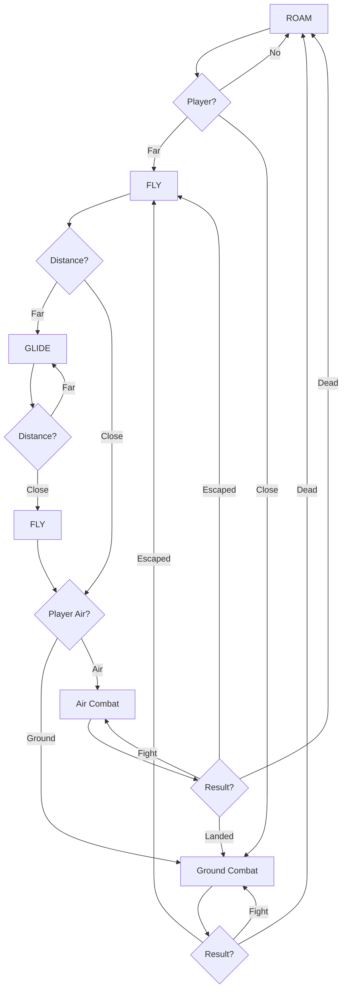
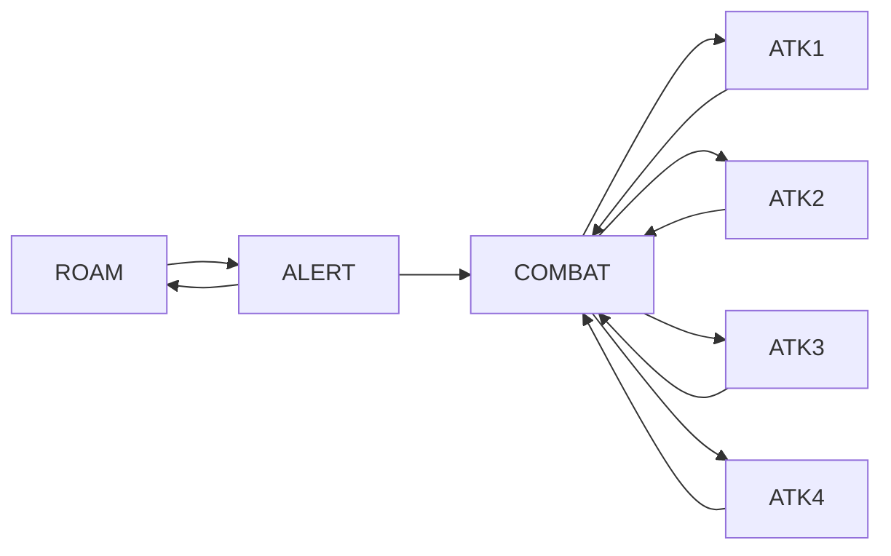
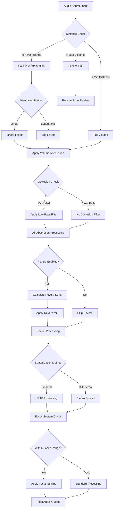

**Project Name:** TheHollowPact  
**Engine:** Unreal Engine 5.5.4 
**Mode:** Multiplayer (Listen Server)
**Genre:** Third-Person Shooter RPG  
**Perspective:** Over-the-shoulder third person  
**Target Platform:** PC (with scalability for Console)

A competitive and cooperative multiplayer third-person shooter with RPG styled, modern UI, responsive controls, and high replayability.

## Table of Contents
1. [Character System](#1-character-system)
2. [Multiplayer Architecture](#2-multiplayer-architecture)
3. [Weapons & Combat](#weapons--combat)
4. AIs
5. [User Interface (HUD)](#user-interface-hud)
6. [Audio](#audio)
7. Prop Hunt Game Mode

## 1. Multiplayer Architecture
| Class                           | Responsibility                                                       | Notes                                        |
| ------------------------------- | -------------------------------------------------------------------- | -------------------------------------------- |
| **AGameModeBase / AGameMode**   | Defines game rules and win/loss conditions (server-only)             | Only exists on the server                    |
| **AGameStateBase / AGameState** | Tracks match state, time, score (server + replicated to all clients) | Syncs global data to clients                 |
| **APlayerController**           | Represents the player's input and client control logic               | First class a player "owns"                  |
| **APlayerState**                | Holds player-related data (name, score, team, etc.)                  | Exists on server and all clients             |
| **APawn / ACharacter**          | The controllable actor (body) in the world                           | Possessed by PlayerController                |
| **AHUD**                        | Basic on-screen UI manager (legacy)                                  | Generally replaced by UMG in modern projects |
| **UUserWidget**                 | UI elements created via Unreal Motion Graphics (UMG)                 | For health bars, ammo, HUDs, menus           |
![[Pasted image 20250527144035.png]]![[Pasted image 20250527144745.png]]![[Pasted image 20250527144749.png]]

# 2. Character System
**Complex Locomotion System**
![[Pasted image 20250527144925.png]]
Character has various states it can be in 
-> UnArmed
	- UnArmed Normal
	- UnArmed Crouch
	- UnArmed Jump
	- UnArmed Run
-> Bow State
	- Bow Normal
	- Bow Crouch
	- Bow Jump
	- Bow Running
-> Rifle State
	- Rifle Normal
	- Rifle Crouch
	- Rifle Jump
	- Rifle Running
-> Sword State
-> Idle State
-> Death State
The PawnBlueprint holds the variables that are used to set values in the AnimationBlueprint thats attached to the SkeletalMesh Component.

**Head Gaze Tracking**
![[vivaldi_tZ3Su8bahJ-ezgif.com-cut (1).gif]]
We dynamically adjust the **rotation value of** neck and upper spines of our character, according to where the players the player is looking to give more dynamic feel.
![[Pasted image 20250527144956.png]]

**Dynamic Movements (Footsteps, turning)**
We have implemented an dynamic blending between movements in different direction to give more realistic feel

## 3 . Combat & Weapons
- Combat Camera
- Weapon 
	- Equip
	- Swap
- Interaction System 
	- Weapon/Ammo/Grenade Equip/Drop
- Shooting System (AmmoInventory, Reload, Firing On Server, Animations, VFX, MuzzleFlash)

##  4. AIs
![[Pasted image 20250527165943.png]]
Dragon **AI LOGIC**: 

**Animation System**
![[Pasted image 20250527165609.png]]
**Barghest, Cenatur, Kraken, Griffon**
![[Pasted image 20250527165725.png]]
**Kraken**
![[Pasted image 20250527170018.png]]
**SwordsMaster**
![[UnrealEditor_rJ8zmcuKa9.gif]]

## 5. HUD
![[screenshot20250527172748.png]]
![[2025 01 25 23 21 15 3-3 screenshot.png]]
**Compass**
For the compass HUD, we have an texture that we loop and roll over, to give the compass effect. The position & offset on the texture is changed through the controller class.   
![[Pasted image 20250527182014.png]]
**MiniMap**
There are two-modes,
1) Camera that is held above head of the player, the output of that camera is passed through an color grading filter. (for performance we render that camera at low resolutions) (**active**)
2) Track characters location, and maps it onto the premade level texture.

**MessageBox**
The function to call `showMessageBox()` function can through the `PlayerController` 

**Weapon/Health/Ammo/Grenade**
The value of those variables are stored within the pawn, and on every change in the value of those variable, a function gets called to update the HUD values. 
*The ClipAmmo & inventoryAmmo changes based on the weapon currently in possession*

**HitMarker**
Whenever player manages to land an successive hit, red hitmarker gets cropped up to provide visual-feedback to player.

![[UnrealEditor_Uvwf7hT61F.gif]]
## 6. Audio
#### **Ambient Audio Objects**  
 Special actors, that get triggered when actor enters within certain radius. Responsible for playing background ambient noise
`Content/SoundAmbience/Apocalypse`

==**Spatial Audio Attenuation System**==
**Core Features:** 
• Distance-based volume attenuation (linear/logarithmic curves) 
• Configurable min/max distance thresholds (400-4000 units) 
• Real-time 3D position tracking
**Reverb Processing:** 
• Send-based reverb with wet/dry control (0.3-0.95 mix) 
• Distance-dependent reverb send levels • Linear reverb method implementation
**Spatial Audio:** 
• Binaural HRTF spatialization 
• 3D stereo spread (200 units)
• Omni-directional sound placement 
• Radius-based spatial falloff (500 units)
**Advanced Systems:** 
• Environmental occlusion filtering 
• Air absorption (frequency-dependent attenuation) 
• Dynamic listener focus with azimuth scaling 
• Priority-based audio culling
**Technical Implementation:** 
• Plugin-based audio processing 
• Real-time parameter interpolation 
• Performance-optimized for multi-source environments
• Configurable falloff curves and attenuation shapes

#### **Footsteps**, **Roars** , Growl, Scream and other audio effects
We have mostly baked these sounds in the animation themselves, 
**However for gun-impact/hit sounds, we check tag of the material to play different sounds. Even for footsteps we have mechanism in place that changes sounds according to ground, but it's disabled due to lack of quality walking sound assets** 

## 7. PropHunt Game Mode
There's fun multiplayer `gamemode` in our game, where one of the players randomly gets selected as an prop who has to hide from the rest players whose job is to hunt, within the timeframe. 
**Prop Player, have few interesting powers**
1) Ability to transform into any model it's contacting. 
![[UnrealEditor_ScrIA6gnMz.gif]]
2) The PropPlayer ability can make copies of itself to confuse, bait and lure enemies. 
![[UnrealEditor_xj52lYjk0X.gif]]
