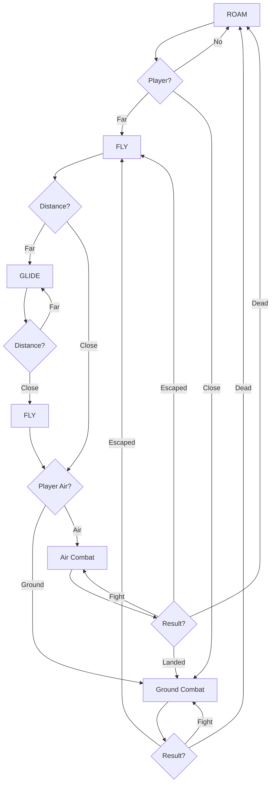
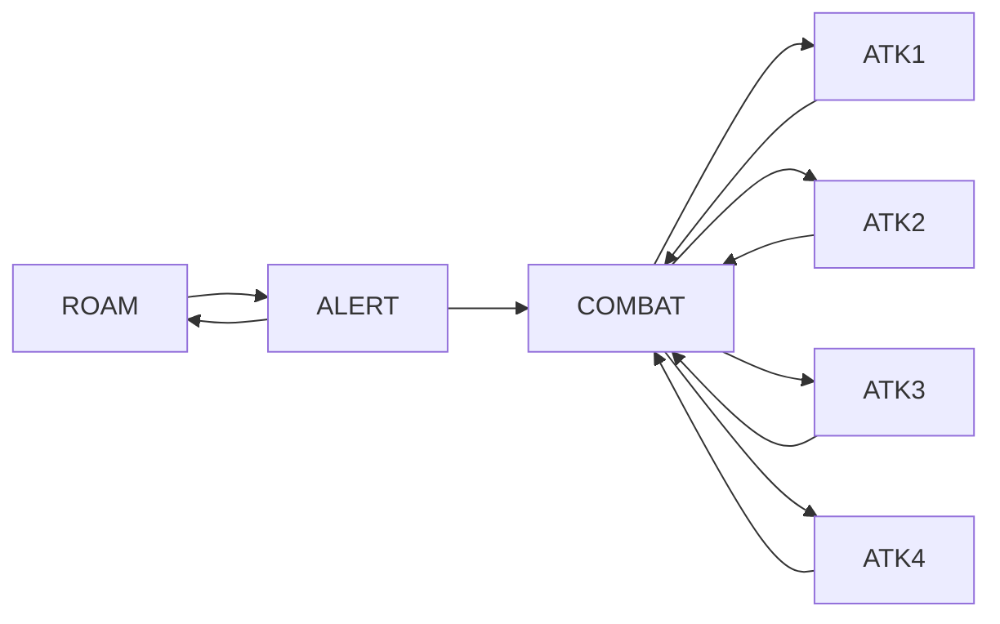
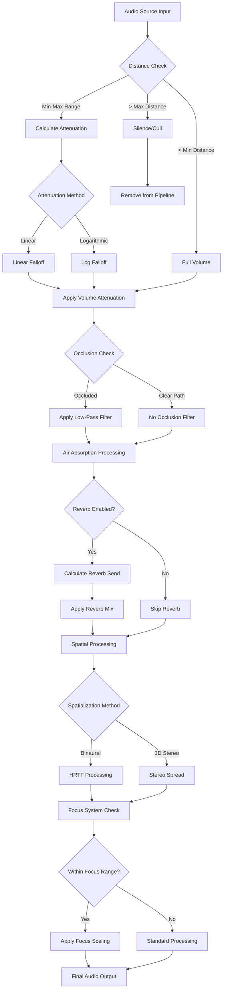

# TheHollowPact

**Engine:** `Unreal Engine 5.5.4`  
**Mode:** `Multiplayer (Listen Server)`  
**Genre:** `Third-Person Shooter RPG`  
**Perspective:** `Over-the-shoulder third person`  
**Target Platform:** `PC (with scalability for Console)`

To Play the Game Directly, you can run the executable from here: 
[🎮Game.exe](https://drive.google.com/file/d/1P3dZV_-bjo79fWiBQgCWrdzBUfkiG-GI/view?usp=sharing)

To look at the Source Code
1. clone the repositry
2. download [Resources.Zip](https://drive.google.com/file/d/19foQoygG6yyGKS8EOkeQvUnY1uCCmEB8/view?usp=sharing) & paste it's contents inside the **hollow_pact/content** folder of the cloned repositry
3. Open the hollow_pact project folder inside Unreal Engine 5.5.4.


_Note: Multiplayer mode is still buggy with few errors so i have disabled it, but the entire code is still fully network replicated_

## Table of Contents
1. [Multiplayer Architecture](#1-multiplayer-architecture)
2. [Character System](#2-character-system)
3. [Weapons & Combat](#3-weapons--combat)
4. [AI Systems](#4-ai-systems)
5. [User Interface (HUD)](#5-user-interface-hud)
6. [Visuals and Audio System](#6-visuals-audio-system)
7. [Prop Hunt Game Mode](#7-prop-hunt-game-mode)

---

## 1. Multiplayer Architecture


## Core Framework Components

| Class | Responsibility | Notes |
|-------|---------------|-------|
| **AGameModeBase / AGameMode** | Defines game rules and win/loss conditions (server-only) | Only exists on the server |
| **AGameStateBase / AGameState** | Tracks match state, time, score (server + replicated to all clients) | Syncs global data to clients |
| **APlayerController** | Represents the player's input and client control logic | First class a player "owns" |
| **APlayerState** | Holds player-related data (name, score, team, etc.) | Exists on server and all clients |
| **APawn / ACharacter** | The controllable actor (body) in the world | Possessed by PlayerController |
| **AHUD** | Basic on-screen UI manager (legacy) | Generally replaced by UMG in modern projects |
| **UUserWidget** | UI elements created via Unreal Motion Graphics (UMG) | For health bars, ammo, HUDs, menus |

# Unreal Engine Multiplayer Framework (diagram for reference & context)  (diagram source: UnrealForums)

## Network Topology & Data Flow

### Server Instance (Authority)
```cpp
// Authority components - single source of truth
GameMode* GM_PropHuntGameMode;           // Game logic, rules, state transitions
GameState* SharedGameState;              // Global match data, replicated to all
PlayerState* PlayerStates[MAX_PLAYERS];  // Per-player persistent data
PlayerController* Controllers[MAX_PLAYERS]; // Input handling, RPC routing
Pawn* Characters[MAX_PLAYERS];           // World entities, physics simulation
```

### Client Instance (Proxy)
```cpp
// Replicated proxies - receive updates from server
GameState* ReplicatedGameState;          // Read-only match state
PlayerState* AllPlayerStates[];          // All player data for scoreboard/UI
PlayerController* OwnedController;       // Local input authority
PlayerController* RemoteControllers[];   // Simulated proxies
Pawn* OwnedCharacter;                   // Autonomous proxy with prediction
Pawn* RemoteCharacters[];               // Simulated proxies
HUD* LocalHUD;                          // Client-side UI rendering
UserWidget* UIElements[];               // Local interface components
```

## Replication Architecture

### Authority-Based Replication (Red Lines)
**GameState → All Clients**
- Match timer, round state, team scores
- Global game configuration
- Environmental state changes

**PlayerState → All Clients**  
- Player names, scores, teams
- Persistent player data
- Cross-client visibility for UI

### Ownership-Based Replication (Blue Lines)
**PlayerController → Owning Client Only**
- Input state, camera data
- Client-specific settings
- Private player information

**Pawn → Owning Client (Autonomous) + Others (Simulated)**
- Movement prediction on owning client
- Replicated movement to other clients
- Combat state, health, animations

## Network Roles & Proxy Types

### Server Authority Components
```cpp
// GameMode - Server exclusive logic
class AGM_PropHuntGameMode : public AGameModeBase {
    UCLASS()
    // Never replicated, exists only on server
    // Handles: player spawning, game rules, win conditions
    
    virtual void PostLogin(APlayerController* NewPlayer) override;
    virtual void HandleMatchHasStarted() override;
    virtual bool ReadyToStartMatch_Implementation() override;
};
```

### Replicated State Management
```cpp
// GameState - Replicated to all clients
class ACustomGameState : public AGameStateBase {
    UCLASS()
    
    UPROPERTY(Replicated)
    float MatchTimer;
    
    UPROPERTY(Replicated)
    EGamePhase CurrentPhase;
    
    UPROPERTY(ReplicatedUsing=OnRep_TeamScores)
    TArray<int32> TeamScores;
    
    UFUNCTION()
    void OnRep_TeamScores();
};

// PlayerState - Per-player replicated data
class ACustomPlayerState : public APlayerState {
    UCLASS()
    
    UPROPERTY(Replicated)
    int32 Kills;
    
    UPROPERTY(Replicated)
    EPlayerTeam Team;
    
    UPROPERTY(ReplicatedUsing=OnRep_Health)
    float Health;
};
```

### Ownership & Control Flow
```cpp
// PlayerController - Owned by specific client
class APC_PropHuntController : public APlayerController {
    UCLASS()
    
    // Client → Server RPCs (input/commands)
    UFUNCTION(Server, Reliable)
    void ServerFireWeapon(FVector Origin, FVector Direction);
    
    // Server → Client RPCs (feedback/effects)
    UFUNCTION(Client, Reliable)
    void ClientShowHitMarker();
    
    // Autonomous proxy functions
    virtual void SetupInputComponent() override;
    virtual void Tick(float DeltaTime) override;
};
```

### Pawn Replication Complexity
```cpp
// Character - Complex replication behavior
class ABP_ThirdPersonCharacter : public ACharacter {
    UCLASS()
    
    // Replicated properties with different update frequencies
    UPROPERTY(Replicated)
    float Health;                    // High frequency
    
    UPROPERTY(ReplicatedUsing=OnRep_WeaponState)
    EWeaponState CurrentWeapon;      // Event-based
    
    UPROPERTY(Replicated)
    FVector_NetQuantize10 ReplicatedMovement; // Compressed movement
    
    // Server-side validation
    UFUNCTION(Server, Reliable, WithValidation)
    void ServerMove(float Timestamp, FVector NewLocation);
    bool ServerMove_Validate(float Timestamp, FVector NewLocation);
    void ServerMove_Implementation(float Timestamp, FVector NewLocation);
    
    // Client-side prediction
    virtual void OnRep_ReplicatedMovement() override;
    virtual void CorrectClientMovement() override;
};
```

## Client-Side Systems (No Replication)

### HUD & UI Architecture
```cpp
// HUD - Client-only rendering
class ACustomHUD : public AHUD {
    UCLASS()
    
    // Local rendering, no network traffic
    virtual void DrawHUD() override;
    virtual void BeginPlay() override;
    
    // UI widget management
    UPROPERTY(BlueprintReadOnly)
    class UMainHUDWidget* MainWidget;
};

// UserWidget - Pure client-side UI
class UMainHUDWidget : public UUserWidget {
    UCLASS()
    
    // Reads from replicated data, no direct network calls
    UFUNCTION(BlueprintImplementableEvent)
    void UpdateHealthBar(float HealthPercent);
    
    UFUNCTION(BlueprintImplementableEvent)
    void UpdateAmmoDisplay(int32 CurrentAmmo, int32 MaxAmmo);
};
```

## Network Performance Optimizations

### Replication Frequency Control
```cpp
// Variable replication rates based on importance
UPROPERTY(Replicated, meta = (ReplicationFrequency = 60.0f))
FVector HighFrequencyMovement;

UPROPERTY(Replicated, meta = (ReplicationFrequency = 10.0f))
int32 LowFrequencyScore;

// Conditional replication
UPROPERTY(ReplicatedUsing=OnRep_Health, Condition=COND_OwnerOnly)
float PrivateHealth;

UPROPERTY(Replicated, Condition=COND_SkipOwner)
FVector RemotePlayerLocation;
```

### RPC Patterns & Reliability
```cpp
// Reliable RPCs - Guaranteed delivery, ordered
UFUNCTION(Server, Reliable)
void ServerCriticalAction();

// Unreliable RPCs - Best effort, higher performance
UFUNCTION(Server, Unreliable)
void ServerMovementUpdate(FVector Location);

// Multicast RPCs - Server to all clients
UFUNCTION(NetMulticast, Reliable)
void MulticastExplosionEffect(FVector Location);
```

## Authority Validation & Anti-Cheat

### Server-Side Validation
```cpp
// Movement validation example
bool ABP_ThirdPersonCharacter::ServerMove_Validate(float Timestamp, FVector NewLocation) {
    // Distance check
    float MaxMoveDist = GetMaxSpeed() * (Timestamp - LastMoveTimestamp) * 1.1f;
    if (FVector::Dist(GetActorLocation(), NewLocation) > MaxMoveDist) {
        return false; // Potential speed hack
    }
    
    // Physics validation
    if (!GetWorld()->LineTraceSingleByChannel(HitResult, GetActorLocation(), NewLocation, ECC_Pawn)) {
        return false; // Wall clipping attempt
    }
    
    return true;
}
```

### Client Prediction & Rollback
```cpp
// Client-side prediction with server reconciliation
void ABP_ThirdPersonCharacter::ClientPredictMovement(float DeltaTime) {
    if (IsLocallyControlled()) {
        // Predict movement locally
        FVector PredictedLocation = PredictNextLocation(DeltaTime);
        SetActorLocation(PredictedLocation);
        
        // Store for rollback if server disagrees
        MovementHistory.Add({GetWorld()->GetTimeSeconds(), PredictedLocation});
        
        // Send to server for validation
        ServerMove(GetWorld()->GetTimeSeconds(), PredictedLocation);
    }
}

void ABP_ThirdPersonCharacter::OnRep_ReplicatedMovement() {
    if (!IsLocallyControlled()) {
        // Apply server movement to remote clients
        SetActorLocation(ReplicatedMovement_Location);
    } else {
        // Reconcile prediction with server authority
        ReconcileMovement();
    }
}
```

## Memory & Performance Considerations

### Component Lifecycle
- **Server**: Manages all components, highest memory footprint
- **Clients**: Only store relevant replicated data + local UI
- **Garbage Collection**: Automatic cleanup of disconnected player objects
- **Network Culling**: Distance-based relevance filtering

### Bandwidth Optimization
- **Delta Compression**: Only replicate changed values
- **Property Conditions**: Replicate only to relevant clients
- **Update Frequencies**: Critical data at 60Hz, UI data at 10Hz
- **RPC Batching**: Combine multiple calls into single network packet

This architecture ensures deterministic gameplay while minimizing network overhead and maintaining responsive client-side prediction.


</div>

---

## 2. 🦾 Character System

### Complex Locomotion System

<div align="center">


</div>

Our character system features multiple states with seamless transitions:

#### 🏃 Movement States
- **UnArmed State**
  - UnArmed Normal
  - UnArmed Crouch
  - UnArmed Jump
  - UnArmed Run

- **🏹 Bow State**
  - Bow Normal
  - Bow Crouch
  - Bow Jump
  - Bow Running

- **🔫 Rifle State**
  - Rifle Normal
  - Rifle Crouch
  - Rifle Jump
  - Rifle Running

- **⚔️ Sword State**
- **😴 Idle State**
- **💀 Death State**

> The PawnBlueprint holds the variables that are used to set values in the AnimationBlueprint attached to the SkeletalMesh Component.

### 👁️ Head Gaze Tracking

<div align="center">


</div>

We dynamically adjust the **rotation value** of neck and upper spines of our character, according to where the player is looking to give a more dynamic feel.

<div align="center">


</div>

### 🚶 Dynamic Movements (Footsteps, Turning)

We have implemented dynamic blending between movements in different directions to give a more realistic feel.

---

## 3. ⚔️ Weapons & Combat

### Core Combat Features
- **🎥 Combat Camera** - Dynamic camera system for combat scenarios
- **🔫 Weapon Systems**
  - Equip/Unequip mechanics
  - Weapon swapping system
- **🤝 Interaction System**
  - Weapon/Ammo/Grenade pickup and drop
- **💥 Shooting System**
  - AmmoInventory management
  - Reload mechanics
  - Server-side firing validation
  - Combat animations
  - Visual effects (VFX)
  - Muzzle flash system

---

## 4. 🤖 AI Systems

<div align="center">


</div>

### 🐉 Dragon AI Logic



### 🎭 Animation System

<div align="center">


</div>

### 🐺 Creature Collection
- **Barghest** - Mythical hound creature
- **Centaur** - Half-human, half-horse warrior
- **Kraken** - Sea monster with tentacle attacks
- **Griffon** - Eagle-lion hybrid with aerial combat

<div align="center">


</div>

### 🐙 Kraken System

<div align="center">


</div>

### ⚔️ SwordsMaster AI

<div align="center">


</div>



---

## 5. 🖼️ User Interface (HUD)

<div align="center">


</div>

### 🧭 Compass System
For the compass HUD, we use a texture that loops and rolls over to create the compass effect. The position & offset on the texture is changed through the controller class.

<div align="center">


</div>

### 🗺️ MiniMap System
We implemented two modes:

1. **Camera Mode (Active)** - Camera held above the player's head, output passed through color grading filter (rendered at low resolution for performance)
2. **Texture Mode** - Track character location and map it onto premade level texture

### 📢 MessageBox System
The `showMessageBox()` function can be called through the `PlayerController`.

### 📊 Status Displays
- **Weapon/Health/Ammo/Grenade** - Values stored within the pawn, HUD updates on value changes
- **ClipAmmo & InventoryAmmo** - Changes based on currently equipped weapon

### 🎯 HitMarker System
When players land successful hits, red hitmarkers appear to provide visual feedback.

<div align="center">


</div>

---

## 6. 🔊 Visuals & Audio System

### 🌍 Ambient Audio Objects
Special actors that trigger when players enter a certain radius, responsible for playing background ambient noise.
> Location: `Content/SoundAmbience/Apocalypse`

### 🎧 Spatial Audio Attenuation System

#### **Core Features:**
- Distance-based volume attenuation (linear/logarithmic curves)
- Configurable min/max distance thresholds (400-4000 units)
- Real-time 3D position tracking

#### **Reverb Processing:**
- Send-based reverb with wet/dry control (0.3-0.95 mix)
- Distance-dependent reverb send levels
- Linear reverb method implementation

#### **Spatial Audio:**
- Binaural HRTF spatialization
- 3D stereo spread (200 units)
- Omni-directional sound placement
- Radius-based spatial falloff (500 units)

#### **Advanced Systems:**
- Environmental occlusion filtering
- Air absorption (frequency-dependent attenuation)
- Dynamic listener focus with azimuth scaling
- Priority-based audio culling

#### **Technical Implementation:**
- Plugin-based audio processing
- Real-time parameter interpolation
- Performance-optimized for multi-source environments
- Configurable falloff curves and attenuation shapes

### Audio Processing Pipeline



### 🦶 Dynamic Audio Effects
**Footsteps, Roars, Growls, Screams** and other audio effects are mostly baked into the animations themselves.

> **Note:** For gun-impact/hit sounds, we check material tags to play different sounds. We also have a mechanism for footsteps that changes sounds according to ground type, but it's currently disabled due to lack of quality walking sound assets.

### Few `PostProcessing` and `ColorGrading` filters have been applied to enhance the overall look of the game

---

## 7. 🎯 Prop Hunt Game Mode

A fun multiplayer game mode where one player is randomly selected as a prop who must hide from the other players (hunters) within a time limit.

### 🎭 Prop Player Abilities

#### 1. 🔄 Transformation System
Ability to transform into any model the prop player is contacting.

<div align="center">


</div>

#### 2. 🪞 Decoy System  
The PropPlayer can create copies of itself to confuse, bait, and lure enemies.

<div align="center">

.gif?raw=true)

</div>

---

<div align="center">

### ⭐ **Star this repository if you found it interesting!** ⭐

Made with ❤️ using Unreal Engine 5.5.4

</div>
