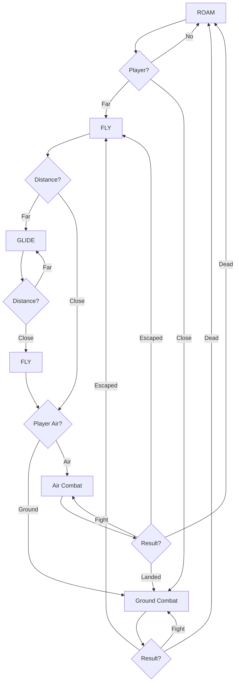
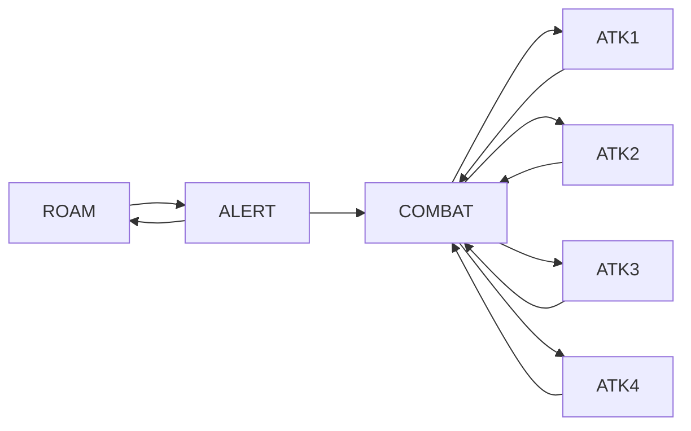
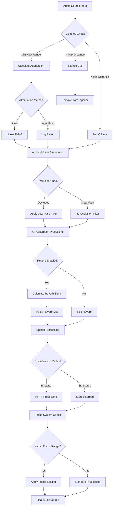

# TheHollowPact

**Engine:** `Unreal Engine 5.5.4`  
**Mode:** `Multiplayer (Listen Server)`  
**Genre:** `Third-Person Shooter RPG`  
**Perspective:** `Over-the-shoulder third person`  
**Target Platform:** `PC (with scalability for Console)`

---

## Table of Contents
1. [Multiplayer Architecture](#1-multiplayer-architecture)
2. [Character System](#2-character-system)
3. [Weapons & Combat](#3-weapons--combat)
4. [AI Systems](#4-ai-systems)
5. [User Interface (HUD)](#5-user-interface-hud)
6. [Audio System](#6-audio-system)
7. [Prop Hunt Game Mode](#7-prop-hunt-game-mode)

---

## 1. Multiplayer Architecture

| Class | Responsibility | Notes |
|-------|---------------|-------|
| **AGameModeBase / AGameMode** | Defines game rules and win/loss conditions (server-only) | Only exists on the server |
| **AGameStateBase / AGameState** | Tracks match state, time, score (server + replicated to all clients) | Syncs global data to clients |
| **APlayerController** | Represents the player's input and client control logic | First class a player "owns" |
| **APlayerState** | Holds player-related data (name, score, team, etc.) | Exists on server and all clients |
| **APawn / ACharacter** | The controllable actor (body) in the world | Possessed by PlayerController |
| **AHUD** | Basic on-screen UI manager (legacy) | Generally replaced by UMG in modern projects |
| **UUserWidget** | UI elements created via Unreal Motion Graphics (UMG) | For health bars, ammo, HUDs, menus |

### Architecture Diagrams

---

## 2. 🦾 Character System

### Complex Locomotion System

Our character system features multiple states with seamless transitions:

#### 🏃 Movement States
- **UnArmed State**
  - UnArmed Normal
  - UnArmed Crouch
  - UnArmed Jump
  - UnArmed Run

- **🏹 Bow State**
  - Bow Normal
  - Bow Crouch
  - Bow Jump
  - Bow Running

- **🔫 Rifle State**
  - Rifle Normal
  - Rifle Crouch
  - Rifle Jump
  - Rifle Running

- **⚔️ Sword State**
- **😴 Idle State**
- **💀 Death State**

> The PawnBlueprint holds the variables that are used to set values in the AnimationBlueprint attached to the SkeletalMesh Component.

### 👁️ Head Gaze Tracking

We dynamically adjust the **rotation value** of neck and upper spines of our character, according to where the player is looking to give a more dynamic feel.

### 🚶 Dynamic Movements (Footsteps, Turning)

We have implemented dynamic blending between movements in different directions to give a more realistic feel.

---

## 3. ⚔️ Weapons & Combat

### Core Combat Features
- **🎥 Combat Camera** - Dynamic camera system for combat scenarios
- **🔫 Weapon Systems**
  - Equip/Unequip mechanics
  - Weapon swapping system
- **🤝 Interaction System**
  - Weapon/Ammo/Grenade pickup and drop
- **💥 Shooting System**
  - AmmoInventory management
  - Reload mechanics
  - Server-side firing validation
  - Combat animations
  - Visual effects (VFX)
  - Muzzle flash system

---

## 4. 🤖 AI Systems

### 🐉 Dragon AI Logic

### 🎭 Animation System

### 🐺 Creature Collection
- **Barghest** - Mythical hound creature
- **Centaur** - Half-human, half-horse warrior
- **Kraken** - Sea monster with tentacle attacks
- **Griffon** - Eagle-lion hybrid with aerial combat

### 🐙 Kraken System

### ⚔️ SwordsMaster AI

---

## 5. 🖼️ User Interface (HUD)

### 🧭 Compass System
For the compass HUD, we use a texture that loops and rolls over to create the compass effect. The position & offset on the texture is changed through the controller class.

### 🗺️ MiniMap System
We implemented two modes:

1. **Camera Mode (Active)** - Camera held above the player's head, output passed through color grading filter (rendered at low resolution for performance)
2. **Texture Mode** - Track character location and map it onto premade level texture

### 📢 MessageBox System
The `showMessageBox()` function can be called through the `PlayerController`.

### 📊 Status Displays
- **Weapon/Health/Ammo/Grenade** - Values stored within the pawn, HUD updates on value changes
- **ClipAmmo & InventoryAmmo** - Changes based on currently equipped weapon

### 🎯 HitMarker System
When players land successful hits, red hitmarkers appear to provide visual feedback.

---

## 6. 🔊 Audio System

### 🌍 Ambient Audio Objects
Special actors that trigger when players enter a certain radius, responsible for playing background ambient noise.
> Location: `Content/SoundAmbience/Apocalypse`

### 🎧 Spatial Audio Attenuation System

#### **Core Features:**
- Distance-based volume attenuation (linear/logarithmic curves)
- Configurable min/max distance thresholds (400-4000 units)
- Real-time 3D position tracking

#### **Reverb Processing:**
- Send-based reverb with wet/dry control (0.3-0.95 mix)
- Distance-dependent reverb send levels
- Linear reverb method implementation

#### **Spatial Audio:**
- Binaural HRTF spatialization
- 3D stereo spread (200 units)
- Omni-directional sound placement
- Radius-based spatial falloff (500 units)

#### **Advanced Systems:**
- Environmental occlusion filtering
- Air absorption (frequency-dependent attenuation)
- Dynamic listener focus with azimuth scaling
- Priority-based audio culling

#### **Technical Implementation:**
- Plugin-based audio processing
- Real-time parameter interpolation
- Performance-optimized for multi-source environments
- Configurable falloff curves and attenuation shapes

### Audio Processing Pipeline

### 🦶 Dynamic Audio Effects
**Footsteps, Roars, Growls, Screams** and other audio effects are mostly baked into the animations themselves.

> **Note:** For gun-impact/hit sounds, we check material tags to play different sounds. We also have a mechanism for footsteps that changes sounds according to ground type, but it's currently disabled due to lack of quality walking sound assets.

---

## 7. 🎯 Prop Hunt Game Mode

A fun multiplayer game mode where one player is randomly selected as a prop who must hide from the other players (hunters) within a time limit.

### 🎭 Prop Player Abilities

#### 1. 🔄 Transformation System
Ability to transform into any model the prop player is contacting.

#### 2. 🪞 Decoy System  
The PropPlayer can create copies of itself to confuse, bait, and lure enemies.

.gif?raw=true)

---

### ⭐ **Star this repository if you found it interesting!** ⭐

Made with ❤️ using Unreal Engine 5.5.4

