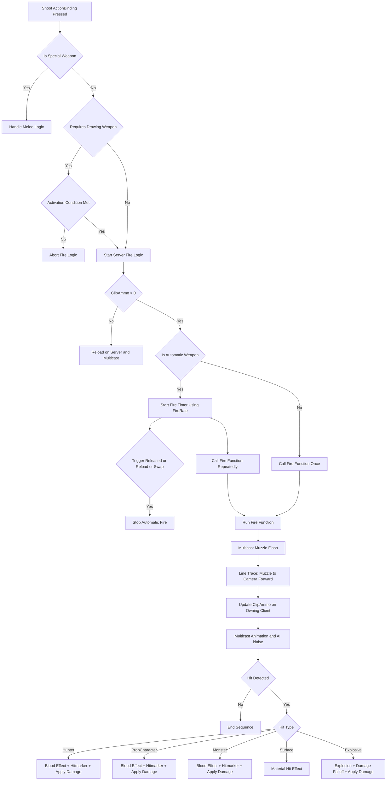

# TheHollowPact

**Engine:** `Unreal Engine 5.5.4`  
**Mode:** `Multiplayer (Listen Server)`  
**Genre:** `Third-Person Shooter RPG`  
**Perspective:** `Over-the-shoulder third person`  
**Target Platform:** `PC (with scalability for Console)`

To Play the Game Directly, you can run the executable from here: 
[🎮Game.exe](https://drive.google.com/file/d/1P3dZV_-bjo79fWiBQgCWrdzBUfkiG-GI/view?usp=sharing)

To look at the Source Code
1. clone the repositry
2. download [Resources.Zip](https://drive.google.com/file/d/19foQoygG6yyGKS8EOkeQvUnY1uCCmEB8/view?usp=sharing) & paste it's contents inside the **hollow_pact/content** folder of the cloned repositry
3. Open the hollow_pact project folder inside Unreal Engine 5.5.4.


_Note: Multiplayer mode is still buggy with few errors so i have disabled it, but the entire code is still fully network replicated_

## Table of Contents
1. [Multiplayer Architecture](#1-multiplayer-architecture)
2. [Character System](#2-character-system)
3. [Weapons & Combat](#3-weapons--combat)
4. [AI Systems](#4-ai-systems)
5. [User Interface (HUD)](#5-user-interface-hud)
6. [Visuals and Audio System](#6-visuals-audio-system)
7. [Prop Hunt Game Mode](#7-prop-hunt-game-mode)

---

## 1. Multiplayer Architecture

## Core Framework Components

| Class | Responsibility | Notes |
|-------|---------------|-------|
| **AGameModeBase / AGameMode** | Defines game rules and win/loss conditions (server-only) | Only exists on the server |
| **AGameStateBase / AGameState** | Tracks match state, time, score (server + replicated to all clients) | Syncs global data to clients |
| **APlayerController** | Represents the player's input and client control logic | First class a player "owns" |
| **APlayerState** | Holds player-related data (name, score, team, etc.) | Exists on server and all clients |
| **APawn / ACharacter** | The controllable actor (body) in the world | Possessed by PlayerController |
| **AHUD** | Basic on-screen UI manager (legacy) | Generally replaced by UMG in modern projects |
| **UUserWidget** | UI elements created via Unreal Motion Graphics (UMG) | For health bars, ammo, HUDs, menus |

[HTML Open Architecture Diagram](https://htmlpreview.github.io/?https://raw.githubusercontent.com/th-efool/TheHollowPact/refs/heads/main/docs/Architecture.html)


# Unreal Engine Multiplayer Framework (diagram for reference & context)  (diagram source: UnrealForums)

## Network Topology & Data Flow

### Server Instance (Authority)
```cpp
// Authority components - single source of truth
GameMode* GM_PropHuntGameMode;           // Game logic, rules, state transitions
GameState* SharedGameState;              // Global match data, replicated to all
PlayerState* PlayerStates[MAX_PLAYERS];  // Per-player persistent data
PlayerController* Controllers[MAX_PLAYERS]; // Input handling, RPC routing
Pawn* Characters[MAX_PLAYERS];           // World entities, physics simulation
```

### Client Instance (Proxy)
```cpp
// Replicated proxies - receive updates from server
GameState* ReplicatedGameState;          // Read-only match state
PlayerState* AllPlayerStates[];          // All player data for scoreboard/UI
PlayerController* OwnedController;       // Local input authority
PlayerController* RemoteControllers[];   // Simulated proxies
Pawn* OwnedCharacter;                   // Autonomous proxy with prediction
Pawn* RemoteCharacters[];               // Simulated proxies
HUD* LocalHUD;                          // Client-side UI rendering
UserWidget* UIElements[];               // Local interface components
```

## Replication Architecture

### Authority-Based Replication (Red Lines)
**GameState → All Clients**
- Match timer, round state, team scores
- Global game configuration
- Environmental state changes

**PlayerState → All Clients**  
- Player names, scores, teams
- Persistent player data
- Cross-client visibility for UI

### Ownership-Based Replication (Blue Lines)
**PlayerController → Owning Client Only**
- Input state, camera data
- Client-specific settings
- Private player information

**Pawn → Owning Client (Autonomous) + Others (Simulated)**
- Movement prediction on owning client
- Replicated movement to other clients
- Combat state, health, animations

## Network Roles & Proxy Types

### Server Authority Components
```cpp
// GameMode - Server exclusive logic
class AGM_PropHuntGameMode : public AGameModeBase {
    UCLASS()
    // Never replicated, exists only on server
    // Handles: player spawning, game rules, win conditions
    
    virtual void PostLogin(APlayerController* NewPlayer) override;
    virtual void HandleMatchHasStarted() override;
    virtual bool ReadyToStartMatch_Implementation() override;
};
```

### Replicated State Management
```cpp
// GameState - Replicated to all clients
class ACustomGameState : public AGameStateBase {
    UCLASS()
    
    UPROPERTY(Replicated)
    float MatchTimer;
    
    UPROPERTY(Replicated)
    EGamePhase CurrentPhase;
    
    UPROPERTY(ReplicatedUsing=OnRep_TeamScores)
    TArray<int32> TeamScores;
    
    UFUNCTION()
    void OnRep_TeamScores();
};

// PlayerState - Per-player replicated data
class ACustomPlayerState : public APlayerState {
    UCLASS()
    
    UPROPERTY(Replicated)
    int32 Kills;
    
    UPROPERTY(Replicated)
    EPlayerTeam Team;
    
    UPROPERTY(ReplicatedUsing=OnRep_Health)
    float Health;
};
```

### Ownership & Control Flow
```cpp
// PlayerController - Owned by specific client
class APC_PropHuntController : public APlayerController {
    UCLASS()
    
    // Client → Server RPCs (input/commands)
    UFUNCTION(Server, Reliable)
    void ServerFireWeapon(FVector Origin, FVector Direction);
    
    // Server → Client RPCs (feedback/effects)
    UFUNCTION(Client, Reliable)
    void ClientShowHitMarker();
    
    // Autonomous proxy functions
    virtual void SetupInputComponent() override;
    virtual void Tick(float DeltaTime) override;
};
```

### Pawn Replication Complexity
```cpp
// Character - Complex replication behavior
class ABP_ThirdPersonCharacter : public ACharacter {
    UCLASS()
    
    // Replicated properties with different update frequencies
    UPROPERTY(Replicated)
    float Health;                    // High frequency
    
    UPROPERTY(ReplicatedUsing=OnRep_WeaponState)
    EWeaponState CurrentWeapon;      // Event-based
    
    UPROPERTY(Replicated)
    FVector_NetQuantize10 ReplicatedMovement; // Compressed movement
    
    // Server-side validation
    UFUNCTION(Server, Reliable, WithValidation)
    void ServerMove(float Timestamp, FVector NewLocation);
    bool ServerMove_Validate(float Timestamp, FVector NewLocation);
    void ServerMove_Implementation(float Timestamp, FVector NewLocation);
    
    // Client-side prediction
    virtual void OnRep_ReplicatedMovement() override;
    virtual void CorrectClientMovement() override;
};
```

## Client-Side Systems (No Replication)

### HUD & UI Architecture
```cpp
// HUD - Client-only rendering
class ACustomHUD : public AHUD {
    UCLASS()
    
    // Local rendering, no network traffic
    virtual void DrawHUD() override;
    virtual void BeginPlay() override;
    
    // UI widget management
    UPROPERTY(BlueprintReadOnly)
    class UMainHUDWidget* MainWidget;
};

// UserWidget - Pure client-side UI
class UMainHUDWidget : public UUserWidget {
    UCLASS()
    
    // Reads from replicated data, no direct network calls
    UFUNCTION(BlueprintImplementableEvent)
    void UpdateHealthBar(float HealthPercent);
    
    UFUNCTION(BlueprintImplementableEvent)
    void UpdateAmmoDisplay(int32 CurrentAmmo, int32 MaxAmmo);
};
```

## Network Performance Optimizations

### Replication Frequency Control
```cpp
// Variable replication rates based on importance
UPROPERTY(Replicated, meta = (ReplicationFrequency = 60.0f))
FVector HighFrequencyMovement;

UPROPERTY(Replicated, meta = (ReplicationFrequency = 10.0f))
int32 LowFrequencyScore;

// Conditional replication
UPROPERTY(ReplicatedUsing=OnRep_Health, Condition=COND_OwnerOnly)
float PrivateHealth;

UPROPERTY(Replicated, Condition=COND_SkipOwner)
FVector RemotePlayerLocation;
```

### RPC Patterns & Reliability
```cpp
// Reliable RPCs - Guaranteed delivery, ordered
UFUNCTION(Server, Reliable)
void ServerCriticalAction();

// Unreliable RPCs - Best effort, higher performance
UFUNCTION(Server, Unreliable)
void ServerMovementUpdate(FVector Location);

// Multicast RPCs - Server to all clients
UFUNCTION(NetMulticast, Reliable)
void MulticastExplosionEffect(FVector Location);
```

## Authority Validation & Anti-Cheat

### Server-Side Validation
```cpp
// Movement validation example
bool ABP_ThirdPersonCharacter::ServerMove_Validate(float Timestamp, FVector NewLocation) {
    // Distance check
    float MaxMoveDist = GetMaxSpeed() * (Timestamp - LastMoveTimestamp) * 1.1f;
    if (FVector::Dist(GetActorLocation(), NewLocation) > MaxMoveDist) {
        return false; // Potential speed hack
    }
    
    // Physics validation
    if (!GetWorld()->LineTraceSingleByChannel(HitResult, GetActorLocation(), NewLocation, ECC_Pawn)) {
        return false; // Wall clipping attempt
    }
    
    return true;
}
```

### Client Prediction & Rollback
```cpp
// Client-side prediction with server reconciliation
void ABP_ThirdPersonCharacter::ClientPredictMovement(float DeltaTime) {
    if (IsLocallyControlled()) {
        // Predict movement locally
        FVector PredictedLocation = PredictNextLocation(DeltaTime);
        SetActorLocation(PredictedLocation);
        
        // Store for rollback if server disagrees
        MovementHistory.Add({GetWorld()->GetTimeSeconds(), PredictedLocation});
        
        // Send to server for validation
        ServerMove(GetWorld()->GetTimeSeconds(), PredictedLocation);
    }
}

void ABP_ThirdPersonCharacter::OnRep_ReplicatedMovement() {
    if (!IsLocallyControlled()) {
        // Apply server movement to remote clients
        SetActorLocation(ReplicatedMovement_Location);
    } else {
        // Reconcile prediction with server authority
        ReconcileMovement();
    }
}
```

## Memory & Performance Considerations

### Component Lifecycle
- **Server**: Manages all components, highest memory footprint
- **Clients**: Only store relevant replicated data + local UI
- **Garbage Collection**: Automatic cleanup of disconnected player objects
- **Network Culling**: Distance-based relevance filtering

### Bandwidth Optimization
- **Delta Compression**: Only replicate changed values
- **Property Conditions**: Replicate only to relevant clients
- **Update Frequencies**: Critical data at 60Hz, UI data at 10Hz
- **RPC Batching**: Combine multiple calls into single network packet

This architecture ensures deterministic gameplay while minimizing network overhead and maintaining responsive client-side prediction.


</div>

---

## 2. Character System

### Complex Locomotion System

<div align="center">


</div>

Our character system features multiple states with seamless transitions:

#### Movement States
- **UnArmed State**
  - UnArmed Normal
  - UnArmed Crouch
  - UnArmed Jump
  - UnArmed Run

- **Bow State**
  - Bow Normal
  - Bow Crouch
  - Bow Jump
  - Bow Running

- **Rifle State**
  - Rifle Normal
  - Rifle Crouch
  - Rifle Jump
  - Rifle Running

- **Sword State**
- **Idle State**
- **Death State**

> The PawnBlueprint holds the variables that are used to set values in the AnimationBlueprint attached to the SkeletalMesh Component.

### Head Gaze Tracking

<div align="center">


</div>

We dynamically adjust the **rotation value** of neck and upper spines of our character, according to where the player is looking to give a more dynamic feel.

<div align="center">


</div>

### Dynamic Movements (Footsteps, Turning)


We have implemented dynamic blending between movements in different directions to give a more realistic feel.
---

## 3. Weapons & Combat

### Core Combat Features
#### **Combat Camera**
| State | Trigger | Camera Distance | Exit Condition |
|-------|---------|----------------|----------------|
| **Normal TPS** | Default | Standard distance | RMB pressed + weapon equipped |
| **Combat Mode** | RMB hold + weapon equipped | Closer to character | RMB release OR weapon unequip/drop |

.gif?raw=true)

| Action | Input | Transition | Result |
|--------|-------|------------|---------|
| **Enter Combat** | RMB hold | Sigmoid curve | Close camera distance |
| **Exit Combat** | RMB release OR weapon lost | Sigmoid curve | Return to normal TPS |
  
#### Weapon System 
| Variable | Type | Purpose | Values |
|----------|------|---------|--------|
| `BackWeaponIndex` | Integer | Tracks weapon stored on back | -1 (empty), 0-N (weapon ID) |
| `HandWeaponIndex` | Integer | Tracks weapon in active hand | -1 (empty), 0-N (weapon ID) |
| `ClipAmmo[]` | Array | Current ammo in clip for each weapon | 0 to ClipMaxAmmo[index] |
| `ClipMaxAmmo[]` | Array | Maximum clip capacity for each weapon | Weapon-specific values |
| `InventoryAmmo[]` | Array | Reserve ammo for each weapon | 0 to max inventory |

#### Weapon States & Actions
| Weapon Slot | Current State | Visibility | Available Actions | Description |
|-------------|---------------|------------|-------------------|-------------|
| **Active Hand** | Equipped | Visible | Swap, Unequip | Primary weapon slot. Player actively holds and can use this weapon for combat, aiming, and firing. |
| **Back Holster** | Holstered | Visible | Equip, Swap | Secondary weapon slot. Weapon is visible on player's back but cannot be used until equipped to active hand. |
| **Empty Hand** | None | N/A | Equip from Back, Pickup | No weapon in hand. Can equip from back or pickup new weapon. |
| **Empty Back** | None | N/A | Holster from Hand | No weapon on back. Can holster current hand weapon. |

#### Player Actions
| Action | Input Key | Condition | Result | Animation | HUD Update |
|--------|-----------|-----------|--------|-----------|------------|
| **Equip from Back** | `E` | Hand empty + Weapon on back | Move weapon from back to hand | Draw animation | Update to hand weapon stats |
| **Unequip to Back** | `E` | Weapon in hand + Back empty | Move weapon from hand to back | Holster animation | Clear hand weapon HUD |
| **Swap Weapons** | `Tab` | Both slots occupied | Exchange hand ↔ back positions | Swap animation | Update to new hand weapon |
| **Drop Weapon** | `G` | Weapon in hand or back | Remove from inventory, spawn in world | Drop animation | Remove from HUD |
| **Pickup Weapon** | `F` | Near weapon + Available slot | Add to inventory (hand preferred) | Pickup animation | Add weapon to HUD |

#### Animation Event System
| Animation Phase | Event Trigger | System Response | HUD Response |
|-----------------|---------------|-----------------|--------------|
| **Start Animation** | Animation begins | Lock player input | Show transition indicator |
| **Mid-Point Frame** | Notify event called | Switch weapon visibility | Begin HUD transition |
| **Complete Animation** | Animation ends | Unlock player input | Finalize HUD update |

#### HUD Update Logic
| Trigger | HUD Elements Updated | Data Source |
|---------|---------------------|-------------|
| Weapon equipped to hand | Ammo display, weapon name, crosshair | `ClipAmmo[HandWeaponIndex]`, `InventoryAmmo[HandWeaponIndex]` |
| Weapon holstered | Clear active weapon display | N/A |
| Weapon swapped | All weapon-specific UI elements | New `HandWeaponIndex` data |
| Ammo consumed | Ammo counters | Updated `ClipAmmo[HandWeaponIndex]` |


### **Interaction System**
#### Pickup & Interaction System
| Class | Parent | Type | Purpose |
|-------|--------|------|---------|
| **PickupMaster** | Base Class | Abstract | Core pickup functionality and interaction logic |
| **BP_AmmoWeaponPickUp** | PickupMaster | Parent | Base class for all ammunition pickups |
| **BP_WeaponPickup** | PickupMaster | Parent | Base class for all weapon pickups |
| **BP_Grenade** | BP_AmmoWeaponPickUp | Child | Grenade ammunition pickup |
| **BP_LandMine** | BP_AmmoWeaponPickUp | Child | Landmine ammunition pickup |


#### Widget System
| Component | Trigger | Display | Function |
|-----------|---------|---------|----------|
| **Widget Component** | Player in interaction radius | Hovering UI widget | Shows pickup prompt and item info |
| **Interaction Radius** | Proximity detection | Auto-show/hide | Manages widget visibility based on player distance |

#### Pickup Types by Weapon
| Weapon | Pickup Class | Widget Asset | Ammo Asset |
|--------|--------------|--------------|------------|
| **W1-Gun** | BP_WeaponPickup | W1-GunWidget | W1Ammo |
| **W2-Gun** | BP_WeaponPickup | W2-GunWidget | W2Ammo |
| **W3-Gun** | BP_WeaponPickup | W3-GunWidget | W3Ammo |
| **W4-Gun** | BP_WeaponPickup | W4-GunWidget | W4Ammo |
| **W5-Gun** | BP_WeaponPickup | W5-GunWidget | W5Ammo |
| **W6-Gun** | BP_WeaponPickup | W6-GunWidget | W6Ammo |
| **W7-Bow** | BP_WeaponPickup | W7-BowWidget | W7Ammo |

### **Shooting System**

# Shooting System Documentation

## Input Flow

| Step | Check | Condition | Action |
|------|-------|-----------|---------|
| **1** | Shoot Action Pressed | Special weapon (sword) | Skip gun logic, handle melee |
| **2** | Weapon Type | Requires drawing (bow) | Check activation condition |
| **3** | Server Logic | Activation satisfied | Start fire sequence |

## Server Fire Logic

| Step | Process | Check | Result |
|------|---------|-------|--------|
| **1** | Reload Handling | `ClipAmmo > 0` | If false: Reload on server + multicast |
| **2** | Fire Mode Check | `IsAutomatic[HandWeaponIndex]` | True: Start fire timer / False: Single fire |
| **3** | Automatic Fire | Timer active | Call fire function at `fireRate[index]` intervals |
| **4** | Timer Stop | Trigger release OR reload OR weapon swap/unequip | End automatic fire |

## Fire Function (Server)

| Order | Action | Network | Details |
|-------|--------|---------|---------|
| **1** | Muzzle Flash | Multicast | Visual effect at weapon muzzle |
| **2** | Line Trace | Server | Start: Muzzle point / End: Camera forward × bullet range |
| **3** | Magazine Update | Owning Client | Decrease `ClipAmmo[HandWeaponIndex]` |
| **4** | Animation & Noise | Multicast + Server | Fire animation + AI noise signal |
| **5** | Hit Detection | Server | Process hit results |
| **6** | Damage Application | Interface | Call damage interface on hit actor |

## Hit Detection & Effects

| Hit Target | Effect Type | Additional Actions |
|------------|-------------|-------------------|
| **Hunter** (Player) | Blood effect | Show hitmarker UI |
| **PropCharacter** | Blood effect | Show hitmarker UI |
| **Monster** | Blood effect | Show hitmarker UI |
| **Surface** | Material-based | Metal/rock/wood bullet impact |
| **Explosive Weapon** | Explosion effect | Run damage falloff calculation |

## System Arrays

| Array | Type | Purpose | Index |
|-------|------|---------|-------|
| `IsAutomatic[]` | Boolean | Determines fire mode | `HandWeaponIndex` |
| `fireRate[]` | Float | Fire interval for automatic weapons | `HandWeaponIndex` |
| `ClipAmmo[]` | Integer | Current magazine ammo | `HandWeaponIndex` |

## Network Architecture

| Function | Execution | Purpose |
|----------|-----------|---------|
| **Shoot Action** | Client Input | Trigger fire sequence |
| **Fire Logic** | Server | Authority for shooting mechanics |
| **Muzzle Flash** | Multicast | Visual feedback |
| **Magazine Update** | Owning Client | UI ammo display |
| **Animation & Noise** | Multicast + Server | Visual + AI detection |


---

## 4. AI Systems

<div align="center">


</div>

### Dragon AI Logic


### Animation System

<div align="center">


</div>

### Creature Collection
- **Barghest** - Mythical hound creature
- **Centaur** - Half-human, half-horse warrior
- **Kraken** - Sea monster with tentacle attacks
- **Griffon** - Eagle-lion hybrid with aerial combat

<div align="center">


</div>

### Kraken System

<div align="center">


</div>

### SwordsMaster AI

<div align="center">


</div>


---

## 5. User Interface (HUD)

<div align="center">


</div>

### Compass System
For the compass HUD, we use a texture that loops and rolls over to create the compass effect. The position & offset on the texture is changed through the controller class.

<div align="center">


</div>

### MiniMap System
We implemented two modes:

1. **Camera Mode (Active)** - Camera held above the player's head, output passed through color grading filter (rendered at low resolution for performance)
2. **Texture Mode** - Track character location and map it onto premade level texture

### MessageBox System
The `showMessageBox()` function can be called through the `PlayerController`.

### Status Displays
- **Weapon/Health/Ammo/Grenade** - Values stored within the pawn, HUD updates on value changes
- **ClipAmmo & InventoryAmmo** - Changes based on currently equipped weapon

### HitMarker System
When players land successful hits, red hitmarkers appear to provide visual feedback.

<div align="center">


</div>

---

## 6. Visuals & Audio System

### 🌍 Ambient Audio Objects
Special actors that trigger when players enter a certain radius, responsible for playing background ambient noise.
> Location: `Content/SoundAmbience/Apocalypse`

### 🎧 Spatial Audio Attenuation System

#### **Core Features:**
- Distance-based volume attenuation (linear/logarithmic curves)
- Configurable min/max distance thresholds (400-4000 units)
- Real-time 3D position tracking

#### **Reverb Processing:**
- Send-based reverb with wet/dry control (0.3-0.95 mix)
- Distance-dependent reverb send levels
- Linear reverb method implementation

#### **Spatial Audio:**
- Binaural HRTF spatialization
- 3D stereo spread (200 units)
- Omni-directional sound placement
- Radius-based spatial falloff (500 units)

#### **Advanced Systems:**
- Environmental occlusion filtering
- Air absorption (frequency-dependent attenuation)
- Dynamic listener focus with azimuth scaling
- Priority-based audio culling

#### **Technical Implementation:**
- Plugin-based audio processing
- Real-time parameter interpolation
- Performance-optimized for multi-source environments
- Configurable falloff curves and attenuation shapes

### Audio Processing Pipeline


### Dynamic Audio Effects
**Footsteps, Roars, Growls, Screams** and other audio effects are mostly baked into the animations themselves.

> **Note:** For gun-impact/hit sounds, we check material tags to play different sounds. We also have a mechanism for footsteps that changes sounds according to ground type, but it's currently disabled due to lack of quality walking sound assets.

### Few `PostProcessing` and `ColorGrading` filters have been applied to enhance the overall look of the game

---

## 7. Prop Hunt Game Mode

A fun multiplayer game mode where one player is randomly selected as a prop who must hide from the other players (hunters) within a time limit.

### Prop Player Abilities

#### 1. Transformation System
Ability to transform into any model the prop player is contacting.

<div align="center">


</div>

#### 2. Decoy System  
The PropPlayer can create copies of itself to confuse, bait, and lure enemies.

<div align="center">

.gif?raw=true)

</div>

---

<div align="center">

### ⭐ **Star this repository if you found it interesting!** ⭐

Made with ❤️ using Unreal Engine 5.5.4

</div>
